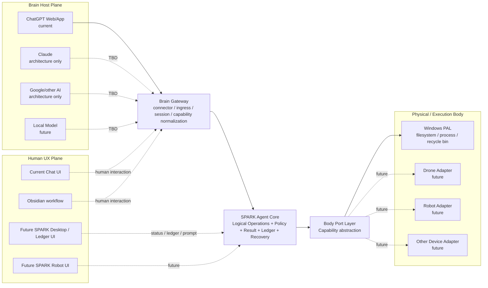

# ARCH — SPARK (Symbiotic Personal AI Robotic Keeper)

**Version:** 0.0.1
**Status:** Accepted Architecture Baseline
**Architecture review:** 2026-09-12 / 1.23

## 1. Purpose and Product Boundary

SPARK는 특정 AI UI나 특정 model에 종속된 coding agent가 아니라 **AI Brain과 local/physical capability 사이의 provider-neutral Agent Core**를 제공한다.

현재 first Brain Host는 ChatGPT Web/App이고 OpenAI Secure MCP Tunnel을 통해 연결한다. ChatGPT subscription message를 사용해 별도 model API 비용을 피하는 방식은 중요한 current deployment strategy이지만 Agent Core의 dependency가 아니다.

장기적으로 Brain Host는 ChatGPT, Claude, Google 계열 agent, local model 또는 다른 reasoning host로 교체될 수 있고, Body는 filesystem/process에서 drone/robot/device로 확장될 수 있다.

## 2. Stable Layer Model



Durable relationship:

```text
AI Brain
  -> Brain Gateway
  -> SPARK Agent Core + Human UX Plane
  -> Body Port
  -> Physical / Execution Adapter
```

## 3. Architecture Principles

1. **Brain independent** — ChatGPT/Claude/local model은 교체 가능한 Brain Host다.
2. **Brain Gateway boundary** — Brain별 connector, quota/session, ingress 차이는 Core 앞에서 흡수한다.
3. **Protocol independent Core** — MCP는 current transport adapter이며 Core domain model이 아니다.
4. **UX independent Core** — Chat UI, Obsidian, future SPARK Desktop/Robot UI는 execution Core 밖에 둔다.
5. **Body independent** — Windows filesystem/process는 first Body implementation일 뿐이다.
6. **Logical before physical** — Core logical operation은 PAL/device adapter가 실제 OS/device 동작으로 매핑한다.
7. **Windows-first 0.0.0** — physical target은 Windows. 다른 OS/device PAL은 TBD다.
8. **Fail closed** — hidden elevation/destructive fallback 금지.
9. **Recoverability** — overwrite/modify recovery와 Windows Recycle Bin delete.
10. **Bounded execution** — timeout, descendant cleanup, bounded stdout/stderr.
11. **User-visible ledger** — chat transcript만 operation history로 간주하지 않는다.
12. **No model API dependency** — Transport service 자체는 OpenAI/Anthropic/Google model API를 호출하지 않는다.
13. **Native security delegation** — SPARK는 filesystem/OS provider가 제공하는 native security primitive를 PAL/Body Port를 통해 재사용하며, 같은 목적의 별도 SPARK-specific security substrate를 만들지 않는다.
14. **Security transparency over false isolation** — 현 단계에서는 최소한의 native mechanism을 우선하고 container/VM 같은 heavyweight isolation을 default로 도입하지 않는다. 실용적이고 단순한 native enforcement가 없으면 자체 parser/guardrail로 안전하다고 가장하지 않고 inherited security hole과 영향 범위를 명시한 뒤 implementation을 TBD로 defer한다.

## 4. Brain Gateway

Brain Gateway는 AI Brain과 SPARK Agent Core 사이의 Anti-Corruption Layer다. Model reasoning 자체를 구현하지 않는다.

책임:

- Brain Host별 connector/ingress 차이 격리
- standard protocol adaptation
- capability/tool discovery 및 invocation boundary
- client/session identity normalization
- approval/confirmation metadata 전달 가능성
- optional quota/cost/status observation
- Brain Host 교체 시 Core contract 보호

Current implementation/deployment:

```text
ChatGPT Web/App
  -> OpenAI Secure MCP Tunnel
  -> MCP 2026-07-28 Adapter
  -> SPARK Agent Core
```

Architecture-only future Claude path:

```text
Claude / Claude Desktop
  -> Claude Custom Remote MCP
  -> MCP Adapter
  -> same SPARK Agent Core
```

Claude runtime code/test는 0.0.0에 포함하지 않는다. SPARK는 provider subscription credential을 탈취하거나 unsupported login/OAuth reuse 또는 quota bypass를 시도하지 않는다.

## 5. Human UX Plane

UX는 execution security boundary가 아니다. Future SPARK UI는 flat chat transcript 대신 다음을 독립적으로 표시할 수 있다.

```text
Conversation      | Task / Plan
Operation Ledger  | Artifacts
Workspace         | Status / Approval
```

현재 Obsidian은 optional workflow다. 향후 SPARK Desktop이나 SPARK Robot UI가 대체해도 Core contract는 유지한다.

## 6. Agent Core Logical Services

### 6.1. FileService

- `list_directory`
- `read_file`
- `create_file`
- `write_file`
- `modify_file`
- `create_directory`
- `copy_path`
- `move_path`
- `delete_path`

### 6.2. ProcessService

0.0.0에서는 `run_command`만 구현한다. 이는 simple native CLI/process execution이다.

Future process lifecycle:

```text
start_process
process_status
process_output
stop_process
```

GUI screen/mouse/keyboard/video 제어는 다음 Sprint 이후 별도 ComputerService 대상이다.

### 6.3. StatusService

- health
- lifecycle status
- concise runtime health projection
- operation-ledger lookup remains a separate audit path
- future long-output/report handles

## 7. Policy / Result / Ledger / Recovery

Transport와 Body implementation에 독립적인 공통 semantics:

- allowed-root authorization
- path canonicalization
- traversal/symlink/junction escape defense
- mutation recovery
- normalized result
- operation ledger
- secret/private-state separation
- future approval policy

## 8. Body Port Layer

Current logical ports:

```text
PlatformFilePort
PlatformTrashPort
PlatformProcessPort
PlatformPermissionPort
PlatformInfoPort
```

Future physical ports:

```text
PlatformComputerPort
DronePort
RobotPort
SensorPort
ActuatorPort
```

따라서 동일한 Agent Core가 filesystem/process뿐 아니라 향후 physical actuation까지 확장될 수 있다.

## 9. Authorization and Path Safety

`cwd`는 process의 시작 위치일 뿐 security boundary가 아니다.

```text
workingDirectory != authorizationRoot
```

Filesystem authorization policy는 다음을 적용한다.

- `..` traversal reject
- single-root 구성에서는 absolute/drive-qualified/UNC tool path reject
- multi-root 구성에서는 absolute path를 허용하되 configured root 내부만 허용
- 상대경로가 둘 이상의 Root에 실제로 존재하면 `AMBIGUOUS_ROOT_PATH`로 fail closed하고 absolute path로 명시하도록 요구
- symlink / NTFS junction escape reject
- non-existing target parent-chain escape reject
- Root별 `R` / `W` / `X` capability 적용

Root permission semantics:

```text
R = list/read/copy source
W = create/write/modify/copy destination/move/delete
X = run_command cwd authorization
```

문자열 Root config는 backward compatibility를 위해 `RWX`로 해석한다.

## 10. Security Architecture

### 10.1. Native Provider Security Delegation

SPARK는 filesystem/process security를 독자적인 second security stack으로 다시 구현하지 않는다. PAL/Body Port의 목적 중 하나는 각 filesystem/OS provider가 제공하는 native security primitive를 재사용하고 provider-specific 차이를 Core 밖에 격리하는 것이다.

- FileService의 path validation/canonicalization은 logical authorization과 fail-closed input validation을 담당한다.
- ProcessService의 실제 filesystem/network/process confinement이 필요하면 해당 OS/provider의 native enforcement를 PAL이 사용한다.
- SPARK-specific command parser, regex blocklist, argument inspection, path 문자열 필터는 OS-level confinement의 대체물이 아니다.
- provider native mechanism 자체에 defect 또는 bypass가 있으면 SPARK가 별도 parallel sandbox를 덧씌워 보완한다고 가정하지 않는다. 이는 inherited provider risk로 기록하고 upstream/provider fix 또는 provider replacement로 해결한다.
- 한 OS에서 사용한 mechanism을 다른 OS에 억지로 복제하지 않는다. PAL은 Windows, Linux, macOS 및 향후 device/filesystem provider별 native mechanism을 선택할 수 있다.

이 원칙은 `codex-chatgpt-web`처럼 outer execution provider가 이미 제공하는 sandbox authority를 재사용하는 구조와 동일한 방향이다. SPARK Core는 security policy의 의미를 정의할 수 있지만 physical enforcement mechanism은 provider/PAL이 소유한다.

### 10.2. Simplicity / No Heavyweight Isolation by Default

현 단계에서는 security를 이유로 container, VM 또는 별도 full runtime environment를 SPARK의 기본 dependency로 도입하지 않는다. 목표는 이미 설치된 OS/filesystem provider가 제공하는 최소 native primitive로 요구 boundary를 표현하는 것이다.

```text
SPARK policy intent
  -> PAL / provider adapter
  -> native OS/filesystem security mechanism
```

실용적이고 단순한 native enforcement로 요구 boundary를 만들 수 없으면 다음 순서를 따른다.

1. capability를 실제보다 강하게 표현하지 않는다.
2. application-level parser/guardrail을 security boundary라고 부르지 않는다.
3. 해당 security hole과 영향 범위를 Architecture/Security 문서에 명확히 기록한다.
4. practical native enforcement가 단순하지 않거나 운영 부작용이 큰 경우 구현을 억지로 추가하지 않고 `TBD`로 defer한다.
5. heavyweight isolation은 별도 architecture decision과 명시적 scope가 있을 때만 검토한다.

### 10.3. Current 0.0.0 Command Execution Trust Statement

0.0.0 `run_command`는 **trusted local, non-elevated capability**다.

- explicit executable + argv
- `shell:false` by default
- cwd must resolve inside allowed root
- timeout
- descendant process-tree cleanup
- independently bounded stdout/stderr
- exit code/signal/duration
- automatic UAC/RunAs 금지
- **cwd confinement은 OS filesystem sandbox가 아니다**

현재 구현은 `cwd`의 `X` 권한만 확인한 뒤 child process를 현재 Windows user token으로 실행한다. 따라서 `run_command`로 시작된 `git`, PowerShell, `cmd`, Node.js, Python 또는 다른 executable은 Windows account가 접근 가능한 경로를 직접 접근할 수 있으며, `allowedRoot` 밖의 filesystem을 OS 차원에서 차단하지 않는다. 이는 **0.0.0의 명시적 known security gap**이다.

따라서 현재 `R/W/X`에서 `X`는 "해당 root를 command working directory로 사용할 수 있음"을 의미하며, "child process가 해당 root 밖을 읽거나 쓸 수 없음"을 의미하지 않는다. FileService의 allowed-root confinement와 ProcessService의 host process authority를 동일한 boundary로 간주해서는 안 된다.

현재 영향 범위는 명시적으로 다음과 같다.

- executable 자체는 allowed root 내부에 있을 필요가 없다. `PATH` 또는 absolute executable path로 현재 OS user가 실행 가능한 program을 시작할 수 있다.
- command argv, script/config file, stdin, environment, registry, network response 또는 실행 중 계산된 path는 FileService path policy의 중재 대상이 아니다.
- allowed root 중 하나에 `X`가 있으면 그 root에서 시작한 arbitrary child process는 현재 OS user가 허용받은 범위에서 `R`-only root 또는 아예 configured allowed root가 아닌 경로를 직접 read/write/delete할 수 있다.
- `delete_path`의 Recycle Bin-only 규칙도 FileService semantics이며 arbitrary child process의 `del`, `Remove-Item`, library/API call 같은 삭제에는 적용되지 않는다.
- 따라서 현재 `R/W` capability는 FileService에 대해 강제되지만 ProcessService의 child filesystem authority를 제한하지 않는다.

이 gap은 command-line path 문자열 검사로 해결할 수 없다. 외부 target은 allowed-root 내부의 list/config/script file, environment variable, stdin 또는 child process 내부 로직에서 간접적으로 결정될 수 있기 때문이다. ProcessService filesystem/network confinement은 **TBD**이며, practical provider-native mechanism이 선택되고 실제 outside-root denial regression을 통과하기 전까지 implemented security boundary로 주장하지 않는다.

0.0.0 Windows timeout cleanup은 verified `taskkill /T /F` tree termination을 사용한다. CatDesk에서 확인한 Windows Job Object는 stronger process ownership backend지만 filesystem confinement을 제공하지 않는다. Windows command filesystem boundary를 강화할 때는 별도 SPARK parser가 아니라 Windows가 제공하는 native token/ACL/provider mechanism을 PAL에서 재사용하는 방향을 우선한다.

### 10.4. Cross-Platform Process-Confinement Disposition — TBD

`cwd`만 검사한 뒤 ambient user authority로 child process를 실행하면 같은 종류의 gap은 Windows에만 한정되지 않는다. Linux와 macOS도 별도 OS-level confinement 없이 current user로 `spawn/exec`하면 child가 그 user가 접근 가능한 filesystem을 직접 접근할 수 있다.

| Provider | Native/lightweight candidate | SPARK 0.0.0 disposition |
|---|---|---|
| Windows | restricted token / sandbox SID or account / NTFS ACL-ACE / Job Object / WFP 등 | filesystem/network confinement **TBD**; 현재 미구현 gap 명시 |
| Linux | Landlock 같은 kernel-native filesystem restriction과 필요한 syscall/network primitive; 또는 provider가 이미 제공하는 native sandbox | **TBD**. 단순 native mechanism 우선 조사; container/bwrap를 SPARK default dependency로 정하지 않음 |
| macOS | Seatbelt profile 기반 OS sandbox 등 provider-native mechanism | **TBD**. native provider mechanism 재사용 가능성을 우선 검토 |

Linux/macOS에 native primitive가 존재한다는 사실은 현재 SPARK가 안전하다는 의미가 아니다. PAL이 해당 mechanism을 실제 적용하고 `R`-only/unconfigured path의 write/delete denial을 process-tree 전체에서 검증하기 전까지 ProcessService confinement은 미구현이다.

선정 기준은 동일하다: SPARK-specific second security engine을 만들지 않고, 단순하고 운영 가능한 provider-native enforcement가 있으면 PAL에서 재사용한다. 그런 방식이 충분히 단순하지 않으면 현 gap을 문서화한 상태로 **TBD**에 유지한다.

### 10.5. Cygwin Research — POSIX/ACL Helper, Not a Sandbox

Cygwin은 Windows 위에서 POSIX-style path, shell, GNU file utilities와 ACL tools를 제공하므로 Windows PAL의 helper/provider 후보로 연구 가치가 있다. 특히 NTFS mount에서 Cygwin은 filesystem ACL을 사용해 POSIX permission을 구현하고 `chmod`, `getfacl`, `setfacl` 같은 interface를 Windows ACL에 매핑한다. 따라서 Windows-specific SID/ACE handling을 SPARK Core에 직접 흩뿌리는 대신, 일부 File/Permission PAL operation을 POSIX-like façade로 단순화할 가능성이 있다.

그러나 Cygwin 자체는 ProcessService confinement boundary가 아니다.

- Cygwin process는 여전히 Windows security token과 NTFS ACL의 적용을 받는다.
- `/cygdrive/<drive>`와 mount table을 통해 Windows filesystem을 접근하며, Cygwin은 POSIX path와 Win32-style path를 모두 지원한다.
- Cygwin shell에서 `powershell.exe`, `cmd.exe`, `python.exe` 같은 native Windows executable을 호출할 수 있으므로 Cygwin mount view만으로 outside-root access를 차단했다고 주장할 수 없다.
- 따라서 `Cygwin bash = Linux sandbox`로 취급하지 않는다.

SPARK의 현재 disposition은 다음과 같다.

```text
Cygwin as File/Permission PAL helper        = research candidate
Cygwin as process/filesystem security wall = rejected
ProcessService confinement                  = TBD
```

Cygwin을 실제 dependency로 채택하기 전에는 설치 footprint, update lifecycle, ACL translation edge cases, native-Windows-tool escape semantics, removal/rollback cost를 별도 평가한다. enforcement authority는 Cygwin 자체가 아니라 최종적으로 Windows kernel / access token / NTFS ACL 같은 provider-native mechanism에 있어야 한다.

### 10.6. Native Security State Lifecycle

Provider native mechanism이 persistent OS state를 필요로 하는 경우 그 state도 PAL/provider lifecycle의 일부로 취급한다.

- per-command마다 hidden local account를 생성/삭제하지 않는다.
- persistent sandbox account/SID, ACL/ACE, WFP rule, profile 또는 credential state가 필요한 provider를 채택하면 install/status/uninstall ownership과 rollback을 명시한다.
- session-scoped ACE/temp/process state는 provider가 정상 종료 시 정리하고 crash-recovery 가능한 방식으로 소유해야 한다.
- SPARK는 provider state를 모방하는 별도 shadow security database를 만들지 않는다.

예를 들어 Anthropic Sandbox Runtime의 Windows provider는 dedicated `srt-sandbox` account를 installation-scoped state로 유지하고, session ACE는 reset/process-exit 및 다음 initialize의 crash-recovery에서 정리하며, uninstall은 WFP filters, sandbox account, credential file, setup marker를 제거하는 lifecycle을 제공한다. SPARK가 유사한 provider를 채택할 경우에도 같은 종류의 deterministic lifecycle을 요구한다.

### 10.7. 0.0.1 Multi-user Deployment — Shared Workspace App, Per-instance Tunnel/Auth

Verified ChatGPT Business flow (2026-09-16):

```text
Workspace admin/developer
  -> create SPARK App
  -> Connection = Tunnel
  -> Authentication = Access token / API key
  -> Header scheme = Bearer
  -> Publish to Workspace

Each user
  -> ChatGPT Plugins -> SPARK -> Connect
  -> "Enter access token or API key"
  -> enter that local instance's spk_... key
  -> ChatGPT sends Authorization: Bearer <spk_...>
  -> Secure MCP Tunnel forwards Authorization
  -> local SPARK validates SHA-256(token)
```

The access key is **not entered in the App creation form**. It is entered by each user on the published Plugin's **Connect** screen. This live flow was followed by successful discovery of `Actions · 10` and the 10-tool SPARK surface in a new chat.

Security invariant:

```text
1 local SPARK instance
= 1 tunnel_id
+ 1 Tunnel Runtime/control-plane key
+ 1 SPARK Access Key (spk_...)
```

- A tunnel ID is routing metadata, not sufficient authorization. Workspace members may be able to see/select other tunnels.
- Tunnel Runtime key authenticates the local tunnel-client to OpenAI; SPARK Access Key authorizes MCP requests at the local SPARK boundary.
- `transport.auth.mode=bearer` is mandatory. `auth:none` is rejected fail-closed.
- Raw SPARK Access Key is private `.runtime/secrets/spark-access-key.txt`; config stores only its SHA-256 digest and path. Startup verifies raw-secret/digest consistency.
- Runtime identity binds tunnel ID, control-plane-key SHA-256, SPARK-access-key SHA-256 and profile SHA-256; process reuse requires the same instance identity.
- Missing/wrong `Authorization: Bearer ...` returns HTTP 401; matching key is required for tool access.
- Workspace App definition may be shared; connection credential is entered per user at Plugins → SPARK → Connect.
- OAuth/OIDC and a central payload relay remain deferred for the small-team 0.0.1 scope.
- same-PC hostile-process isolation remains TBD.

### 10.8. File Content and Binary Transfer Semantics

Current `read_file` is intentionally a **UTF-8 text operation**, not a generic byte-transfer operation. It enforces the configured read-size limit and performs fatal UTF-8 decoding. A file that cannot be decoded as UTF-8 is rejected as unsupported encoding.

SPARK does not define "text versus binary" by filename extension or by a heuristic scan. Filesystems store bytes; some arbitrary binary byte sequences may also happen to be valid UTF-8. Therefore the operation semantics are explicit:

```text
read_file/get_text  -> caller requests UTF-8 text semantics
get_file/get_blob   -> future explicit byte/file-transfer semantics
```

Consequences:

- JSON containing numbers that represent byte values is still text if the JSON file itself is valid UTF-8; it is not reclassified as binary because its content describes bytes.
- A nominally binary file whose raw bytes happen to form valid UTF-8 may be returned by a text operation. MIME type/extension are advisory metadata, not a proof of binary-ness.
- A future arbitrary-file download feature must be a separate tool/resource contract rather than weakening `read_file` into silent base64 fallback.
- MCP supports image/audio content and binary `BlobResourceContents` encoded as base64, plus `resource_link` references. Base64 adds material transfer overhead, so large binary transfer requires explicit size limits and should prefer a client-supported resource/download path when available.
- Under the current ChatGPT Secure MCP Tunnel architecture, bytes returned from a local SPARK MCP tool still traverse the OpenAI tunnel path. SPARK therefore must not assume that a local file download is zero-cost or direct merely because the source file is local.

0.0.1 does not add unrestricted binary transfer merely to make every local file downloadable. A future file-transfer capability requires an explicit size/streaming/download design and acceptance test on the actual Brain Host client.

### 10.9. Timeout, Watchdog, Reconciliation and Progress Semantics

All user-facing synchronous waits must be bounded. `run_command` keeps its default 30-second command timeout and may accept an explicit positive `timeoutMs`. The process runner does not wait indefinitely for Node's child `close` event: after process exit it allows a short bounded output-drain grace, and Windows timeout cleanup bounds the `taskkill /T /F` helper itself before returning. This closes the failure mode where a descendant-held stdio handle caused a nominal `COMMAND_TIMEOUT` to remain blocked for hours.

A final operation watchdog also wraps every MCP tool invocation. The default non-command operation watchdog is 30 seconds. `run_command` receives its requested/default command timeout plus a bounded cleanup grace. HTTP request receive time and server shutdown are independently bounded, as are Recycle Bin helper execution, bootstrap downloads, validation HTTP calls, test cases and CI jobs.

Timeout does **not** mean rollback. A command such as `git clone`, compiler/package install, file copy or arbitrary script can have partial side effects before it is killed. Therefore timeout/failure semantics distinguish confirmed completion from uncertain state:

```text
operation timeout / command timeout
  -> stop or bound the controllable execution path
  -> return explicit timeout/failure
  -> stateUncertain=true when mutation may already have occurred
  -> do not blindly retry
  -> inspect/reconcile filesystem, process and/or Git state
  -> only then retry with a larger timeout or choose cleanup
```

If a mutating FileService operation exceeds the generic operation watchdog while its underlying promise has not settled, SPARK records it as a **pending uncertain mutation** and fail-closes subsequent mutations with `UNCERTAIN_MUTATION_IN_FLIGHT`. Read-only inspection remains available for reconciliation. The pending guard clears only when the underlying operation actually settles; if it never settles, operator recovery/restart is required rather than overlapping another mutation.

A user-facing "continue this same command?" interaction still cannot preserve the same process with the current synchronous `run_command` contract. ChatGPT cannot ask a new question until the pending MCP call returns. After timeout, a larger-timeout execution is a **new process**, not continuation, and must follow reconciliation first.

True long-running continuation/progress remains a deferred managed ProcessService lifecycle:

```text
start_process
process_status
process_output
stop_process
```

That design can return a process handle immediately, expose output/status incrementally, ask the user whether to continue, and explicitly stop the managed process when requested. SPARK SHALL NOT emulate continuation by merely timing out the HTTP response while intentionally leaving an unmanaged child running.

OpenAI Secure MCP Tunnel independently bounds MCP transport connection lifetime (currently default 10 minutes) and supports forwarded MCP progress notifications. That transport TTL is an upper transport bound, not SPARK's operation watchdog. Current SPARK JSON-only HTTP MCP does not yet stream in-flight MCP progress notifications.

Operational UX rule for AI-driven SPARK work: multi-stage work SHOULD emit visible `Step n/m` milestone reports before and after meaningful stages or potentially blocking tool calls. A true periodic heartbeat cannot be emitted while one blocking MCP call has control; the Agent must not invent background progress and must report the actual elapsed/result immediately when control returns.

0.0.1 adds an **experimental local progress/usage projection** in `modules/chatgpt-ui`. The watcher polls the loopback Transport health endpoint and injects compact telemetry into unused ChatGPT sidebar regions instead of covering the conversation surface. `SPARK` progress is determinate because it uses local `startedAt/watchdogMs`; Brain progress is only an indeterminate working/elapsed heuristic derived from visible provider UI controls.

For provider usage, the 0.0.1 Windows integration was verified against ChatGPT Desktop's already-loaded authenticated client and its background `rate-limit-status` source. That source performs authenticated `GET /wham/usage` polling and exposes primary/secondary windows (`used_percent`, `limit_window_seconds`, `reset_at`). SPARK does not scrape the visible Usage popup: when the compatible internal client is discoverable, the watcher reads the same provider data without opening the popup, calculates remaining percentage as `100 - used_percent`, and displays the five-hour and weekly windows with reset time/date. The live acceptance observation was `5H 100%` and `WK 76%`, matching the provider Usage popup shown separately by the user. Provider usage is cached for 30 seconds and refreshed fail-soft; if the internal client/API contract is unavailable after a ChatGPT update, the UI falls back to non-authoritative local/model/chat telemetry rather than fabricating quota values.

The progress panels are collision-aware. The top panel is dynamically constrained between the current-mode control and the Search control so Search/activity controls remain visible. The bottom panel is dynamically constrained between the Workspace control and the Update control; the Voice area may be intentionally covered, but Update remains visible. This overlay is UX telemetry only, not an execution or authorization boundary, and it can be disabled with `chatgptUi.progress.enabled=false`.

## 11. Recoverable Delete

Core semantics:

```text
delete_path = recoverable delete request
```

Windows mapping:

```text
delete_path
  -> PlatformTrashPort.delete()
  -> Windows Recycle Bin
```

Recycle Bin operation 실패 시 permanent delete fallback은 금지한다.

## 12. Normalized Result Contract

모든 external tool call은 다음 공통 envelope를 사용한다.

```json
{
  "ok": false,
  "operationId": "op-...",
  "operation": "delete_path",
  "summary": "Deletion was not performed.",
  "changed": false,
  "data": {},
  "durationMs": 12,
  "requiresElevation": true,
  "retryable": false,
  "error": {
    "code": "PERMISSION_DENIED",
    "message": "The operating system denied the operation."
  }
}
```

MCP response는 textual `content`와 `structuredContent`를 함께 제공한다.

## 13. Operation Ledger and Private State

각 operation은 append-only JSONL ledger에 기록한다.

```text
operationId
Timestamp
operation
target
status
changed
durationMs
errorCode
summary
```

`SPARK.cmd status`는 operator가 즉시 판독할 수 있도록 Transport/Tunnel/ChatGPT/ChatGPT UI health를 간결한 projection으로 표시한다. Operation history는 append-only JSONL ledger에 별도로 유지하며 정상 lifecycle console에 전체 ledger/JSON payload를 dump하지 않는다.

Core 자체의 config에 `stateDir`이 없으면 OS user-private state directory를 사용한다. 현재 private-use 배치는 `transport.stateDir=".runtime"`을 사용하여 repository 내부의 Git-ignored `.runtime/`에 config, secret, ledger, recovery, PID/profile 같은 machine-local state를 모은다. tracked source에는 이 상태를 포함하지 않는다.

`ledger/`와 `recovery/`는 배포 artifact가 아니다. `ledger/`는 첫 operation 기록 시, `recovery/`는 최초 recoverable write/modify snapshot 시 각각 `fs.mkdir(..., {recursive:true})`로 자동 생성된다. 따라서 clone/package에는 두 디렉터리가 없어야 정상이며, 삭제된 clean state에서도 runtime이 스스로 재생성할 수 있어야 한다.

Transport config 탐색 순서는 명시적 `configPath` → 실제 존재하는 `SPARK_CONFIG` → 존재하는 `modules/transport/config/spark.local.json` → `.runtime/config/spark.local.json` fallback이다. tracked template은 `modules/transport/config/spark.example.json`만 유지한다.

Secure MCP Tunnel의 process reuse는 liveness와 runtime identity를 분리해 판단한다. `/readyz`가 `ready`라는 사실만으로 기존 process를 재사용하지 않으며, config `tunnel.id`, generated profile의 `tunnel_id`, SPARK-owned PID, `.runtime/tunnel-runtime.json`, profile path/SHA-256이 일치하고 Control Plane poll까지 성공해야 동일 runtime으로 인정한다. 불일치하면 기존 profile을 private recovery에 보존한 뒤 현재 config 기준으로 재생성하고 tunnel-client를 다시 시작한다.

Local-only state boundary는 clone마다 달라질 수 있는 `.git/info/exclude`나 user-global ignore가 아니라 tracked repository policy로 정의한다. `.gitignore`가 `_pArc/`, `.runtime/`, private `spark.local.json`, nested GitHub Wiki working tree `.SPARK.wiki`를 직접 제외해야 하며, release hygiene 검증도 tracked rule만으로 동일 결과가 재현되어야 한다. `.SPARK.wiki`는 GitHub Wiki remote를 가진 별도 Git repository이며 SPARK main repository의 tracked tree에 포함하지 않는다.

Root `scripts/`는 SPARK 전체 lifecycle orchestration(`start-all/status-all/stop-all`)만 소유한다. tunnel bootstrap과 Windows Transport validation처럼 Transport에만 속하는 script는 `modules/transport/scripts/`가 소유한다.

## 14. Brain Host Cost / Quota Rule

이 문서의 **Brain Host / Cost / Quota Comparison** chapter가 research source다.

- Consumer/subscription Chat + official connector/MCP는 valid Brain deployment mode다.
- Coding-product allowance, API/PAYG, local model은 별도 cost modes다.
- quota 숫자는 provider policy이므로 Agent Core에 hard-code하지 않는다.
- historical allowance를 current guarantee로 취급하지 않는다.

## 15. Source Architecture References

이 문서의 **Architecture Reference Study** chapter를 참조한다.

- **CatDesk** — process ownership, timeout/cancel cleanup, bounded output, Windows Job Object concept, logical tools 우선.
- **Local Coding Agent** — working directory vs authorization separation, capability concept, missing-target canonicalization, private authority state. AGPL source 직접 복사 금지 unless license strategy accepts it.
- **ChatGPT Local Coder** — structured result/activity stream/process lifecycle decomposition. Open full-machine security model은 채택하지 않음.
- **OpenAI Codex** — Windows native sandbox의 restricted token, sandbox principal/account, root ACL/ACE, process ownership 구조 reference.
- **Anthropic Sandbox Runtime** — provider-native filesystem/network isolation과 install/session/uninstall lifecycle reference. Windows support 상태와 operational cost는 별도 검토 대상.
- **codex-chatgpt-web** — bridge가 자체 parallel permission sandbox를 발명하지 않고 outer Codex execution/sandbox authority를 재사용하는 delegation pattern reference.
- **Jan** — future provider-neutral/local-model client and UI reference.

## 16. Implemented Scope

### 16.1. Inherited 0.0.0 baseline

- 10 MCP tools: read/list/CRUD/delete/run_command
- recovery backup + SHA-256
- Windows Recycle Bin delete
- timeout + verified descendant cleanup
- bounded output
- normalized result
- JSONL operation ledger
- private default state directory
- lifecycle/status
- Windows + Linux CI

### 16.2. 0.0.1 multi-user / deployment release-candidate additions

- per-instance `Authorization: Bearer` validation with only SHA-256 token digest stored locally
- `SPARK auth generate` using Node.js `crypto.randomBytes(32)` / OS CSPRNG for a 256-bit access key
- `SPARK init` first-use provisioning that refuses to overwrite an existing private config and prints the raw access key only for initial connection setup
- fail-closed example config with bearer auth enabled and a non-working placeholder digest until first-use provisioning replaces it
- distinct per-user/device Secure MCP Tunnel + per-instance access-key deployment model with no SPARK-operated central payload relay
- bounded command/tool/request/lifecycle watchdogs plus `stateUncertain` reconciliation semantics after timed-out mutations
- experimental ChatGPT UI progress/usage strip: Brain working/elapsed heuristic, exact SPARK watchdog progress, popup-free provider usage telemetry from the authenticated ChatGPT Desktop `GET /wham/usage` source when compatible, and fail-soft fallback when that provider contract is unavailable
- collision-aware sidebar placement that keeps Search/activity and Update visible while using otherwise unused sidebar header/footer space
- PowerShell web-request progress rendering suppressed during tunnel readiness polling to avoid the blinking `Reading web response` console UI while preserving the polling/watchdog behavior
- `SPARK.cmd restart` no longer depends on a self-recursive batch `call`/`:restart` label path; restart directly executes bounded stop then start lifecycle scripts
- ChatGPT UI runtime JSON reader tolerates the Windows PowerShell UTF-8 BOM used by existing runtime files

Architecture-only / deferred:

- Claude/Google/local-model Brain adapter
- GUI Computer Use
- Drone/Robot/device adapters
- elevated helper
- native Windows Job Object backend
- ProcessService filesystem/network confinement — TBD per OS/provider; current `X` remains cwd authorization only
- alternate SPARK Desktop/Robot UI

## 17. ADR Summary

| ADR | Decision |
|---|---|
| ADR-001 | MCP `2026-07-28` standard-only |
| ADR-002 | Brain Host와 Agent Core 분리 |
| ADR-003 | Brain Gateway가 provider/connector 차이를 흡수 |
| ADR-004 | UX는 Core와 분리된 Human UX Plane |
| ADR-005 | Agent Core와 Physical Body를 Body Port/PAL로 분리 |
| ADR-006 | 0.0.0 physical target = Windows |
| ADR-007 | FileService와 ProcessService 분리 |
| ADR-008 | GUI/Computer Use는 후속 Sprint |
| ADR-009 | working directory와 authorization root 분리 |
| ADR-010 | normalized result + operation ledger |
| ADR-011 | Windows delete = Recycle Bin; no permanent fallback |
| ADR-012 | automatic UAC/elevation 금지 |
| ADR-013 | command = timeout + verified tree cleanup + bounded output |
| ADR-014 | private state default는 workspace 밖 |
| ADR-015 | quota/cost는 Brain deployment policy이며 Core constant가 아님 |
| ADR-016 | Claude/other Brain implementation은 target E2E 가능 시점까지 deferred |
| ADR-017 | future physical capability = Computer/Drone/Robot/Sensor/Actuator ports |
| ADR-018 | Secure MCP Tunnel reuse requires config/profile/PID/hash identity + successful Control Plane poll; ready-only reuse 금지 |
| ADR-019 | local-only source boundary는 tracked `.gitignore`로 재현 가능해야 하며 clone-local/global ignore에 의존하지 않음 |
| ADR-020 | lifecycle console은 concise stage/status projection만 출력하고 detailed diagnostics/audit는 local runtime state에 보존 |
| ADR-021 | Security enforcement는 PAL/provider가 제공하는 native OS/filesystem mechanism을 재사용하며, 동일 목적의 parallel SPARK-specific sandbox를 만들지 않음 |
| ADR-022 | Container/VM 같은 heavyweight isolation은 default dependency로 도입하지 않으며, practical native enforcement가 없으면 capability를 과장하지 않고 security gap을 명시 |
| ADR-023 | Current `run_command`의 `X`는 cwd authorization만 의미한다. child process의 filesystem/network confinement은 provider-native PAL 구현이 검증될 때까지 TBD이며, `R`-only 및 unconfigured paths는 ProcessService boundary로 보호된다고 주장하지 않음 |
| ADR-024 | Cygwin은 Windows File/Permission PAL을 단순화할 수 있는 POSIX/ACL helper 후보로만 연구하며, ProcessService sandbox 또는 filesystem security boundary로 취급하지 않음 |
| ADR-025 | 0.0.1 intermediate multi-user deployment는 user/device/SPARK instance별 distinct Secure MCP Tunnel + local instance authorization을 사용하고 중앙 SPARK payload relay를 두지 않음 |
| ADR-026 | 약 5명 규모의 0.0.1에서는 per-instance high-entropy bearer/access token을 최소 인증 방식으로 채택한다. Local SPARK는 raw token 대신 SHA-256 digest를 저장하고 `Authorization: Bearer`를 fail-closed 검증한다. OAuth/OIDC는 account lifecycle이 필요할 때 선택적으로 사용 |
| ADR-027 | text/binary 구분은 heuristic이 아니라 operation contract로 정의한다. `read_file`은 strict UTF-8 text이며 arbitrary binary/file download는 별도 bounded MCP resource/blob/download capability로 설계 |
| ADR-028 | 0.0.1 multi-user 인증은 중앙 OAuth/relay 없이 per-instance high-entropy static bearer/API key를 사용하고, OAuth/OIDC와 same-PC hostile-process isolation은 후속 scope로 defer |
| ADR-029 | 모든 synchronous MCP operation은 bounded watchdog을 갖는다. `run_command`는 process exit/stdio drain/tree-kill까지 bounded하며, timed-out mutation은 `stateUncertain`로 처리하고 reconciliation 전 blind retry를 금지한다. 아직 settle되지 않은 timed-out mutation이 있으면 후속 mutation을 fail-closed로 차단한다. 동일 process의 진짜 continue/streaming progress는 managed asynchronous ProcessService로만 구현한다 |

| ADR-030 | 0.0.1 per-instance SPARK access keys SHALL be generated from 32 CSPRNG bytes (`crypto.randomBytes(32)` / OS entropy), encoded with the `spk_` prefix, and stored by SPARK only as a SHA-256 digest. Human-chosen passwords are not the 0.0.1 default. |
| ADR-031 | Experimental ChatGPT UI progress SHALL distinguish measured SPARK watchdog progress from heuristic Brain-working indication. Provider usage may be shown only from a trustworthy provider value; the verified 0.0.1 ChatGPT Desktop integration reuses the authenticated background `/wham/usage` source without opening the Usage popup and fails soft to local/model/chat telemetry if that internal contract is unavailable. SPARK SHALL NOT fabricate reasoning percentages, token counts, credit consumption, or quota values. |

## 18. Verification Status

0.0.0 baseline acceptance는 다음 검증을 포함한다.

- Node regression 전체 PASS.
- ChatGPT UI theme/config validation PASS.
- source PowerShell parser PASS.
- Windows Transport CRUD/exec/traversal/Recycle Bin validation PASS.
- live Secure MCP Tunnel identity `verified`, Control Plane poll `ok`, ChatGPT `SPARK` app의 10-tool discovery와 MCP smoke PASS.
- tracked-source privacy/secret/hygiene 검사 PASS; `_pArc/`, `.runtime/`, private `spark.local.json`은 release source에서 제외.
- GitHub Actions Node 24 matrix의 Ubuntu/Windows jobs PASS.

Public baseline은 위 gate를 통과한 **single root commit**을 `v0.0.0`으로 tag한다. Independent Architecture Peer review는 별도 process gate이며 이 문서의 author self-check와 동일시하지 않는다.

### 18.2. 0.0.1 release-candidate gate

0.0.1 source promotion is valid only when the following remain true:

- package/runtime/launcher version agree on `0.0.1`.
- per-instance bearer authorization positive/negative regression passes.
- `SPARK auth generate` and `SPARK init` use 256-bit OS-CSPRNG material and do not persist the raw access key.
- new-install example config is fail closed with bearer mode enabled until provisioning replaces the placeholder digest.
- watchdog/reconciliation regressions pass and no known synchronous SPARK-owned wait is unbounded.
- ChatGPT UI theme validation passes and the experimental progress/usage overlay renders on the real ChatGPT Windows DOM without covering required Search/Update controls.
- popup-free provider usage telemetry, when available, matches the provider Usage popup for the same session and is sourced from the authenticated ChatGPT Desktop `/wham/usage` background data rather than fabricated estimates. If that internal contract is unavailable, quota display must fail soft rather than invent values.
- tracked-source hygiene excludes `_pArc/`, `.runtime/`, nested `.SPARK.wiki`, private config, and secrets.
- Windows + Linux CI pass on the candidate commit.
- **Pending final live gate:** after restarting onto the 0.0.1 source, one ChatGPT custom-app connection using `Access token / API key` + Bearer must succeed with its own key and fail with a different instance key. Until that user-scoped E2E passes, do not create/move the `v0.0.1` final tag.

## 19. External References

Project process/verification records are local-only under `_pArc/` (`SWE1.md`, `SWE2.md`, `SWE3.md`, `PIM3.md`). `docs/` intentionally contains only stable architecture and architecture-quality-gate material.

- MCP 2026-07-28: https://blog.modelcontextprotocol.io/posts/2026-07-28/
- CatDesk: https://github.com/Xeift/CatDesk
- Local Coding Agent: https://github.com/LongNgn204/local-coding-agent
- ChatGPT Local Coder: https://github.com/posavr/chatgpt-local-coder
- OpenAI Codex: https://github.com/openai/codex
- Anthropic Sandbox Runtime: https://github.com/anthropics/sandbox-runtime
- codex-chatgpt-web: https://github.com/miuuyy/codex-chatgpt-web
- Cygwin User's Guide / filesystem and ACL behavior: https://cygwin.com/cygwin-ug-net/using.html
- Cygwin `setfacl`: https://cygwin.com/cygwin-ug-net/setfacl.html
- OpenAI ChatGPT Developer Mode / MCP Apps: https://help.openai.com/en/articles/12584461-developer-mode-and-mcp-apps-in-chatgpt
- OpenAI Secure MCP Tunnel client: https://github.com/openai/tunnel-client
- MCP tool/resource binary content: https://modelcontextprotocol.io/specification/2025-11-25/server/tools
- Claude Desktop local MCP / Desktop Extensions: https://support.claude.com/en/articles/10949351-getting-started-with-local-mcp-servers-on-claude-desktop
- Jan: https://github.com/janhq/jan

## Baseline Handoff

`0.0.0`은 inherited verified **private-use baseline**이다. 이 baseline에는 Transport 10-tool, Secure MCP Tunnel, one-click lifecycle, integrated ChatGPT UI, multi-root/RWX policy와 local-only runtime separation이 포함된다. 현재 tracked source는 `0.0.1` multi-user/deployment release candidate이며 per-instance Bearer authorization, 256-bit access-key provisioning, bounded watchdog/reconciliation, sidebar progress/usage telemetry와 deployment hardening을 추가했다. Final `v0.0.1` 승격은 ChatGPT custom-app `Access token / API key` + Bearer own-key success / wrong-key denial live E2E가 끝난 뒤에만 수행한다.

## 20. Architecture Reference Study

**Date:** 2026-09-12
**Purpose:** SPARK Sprint-2 architecture 재정립을 위한 source-level comparison
**Scope:** CatDesk, Local Coding Agent, ChatGPT Local Coder, Jan

## 1. Executive Conclusion

세 coding-agent 프로젝트는 SPARK가 다시 구현할 필요가 없는 문제를 이미 상당 부분 다루고 있다. 그러나 어느 하나도 SPARK의 target architecture를 그대로 제공하지는 않는다.

가장 유용한 조합은 다음과 같다.

```text
CatDesk
  -> process lifecycle / timeout / Windows Job Object / bounded output

Local Coding Agent
  -> permission resolver / root capability / private authority state / local dashboard

ChatGPT Local Coder
  -> structured tool result / activity stream / MCP session + admin UX

Jan
  -> future client/UI / MCP host / provider-neutral and local-model architecture
```

SPARK는 이 요소를 **Client/Transport/Core/Policy/PAL**로 분리하여 조합한다.

## 2. Reproducible Source Snapshots

| Project | Reviewed main commit | License |
|---|---|---|
| CatDesk | `41900ba851334713061053f345740c1ddcaf5283` | MIT |
| Local Coding Agent | `95144e610ddcc3bb5a879117803907c008b1a88e` | AGPL-3.0-or-later |
| ChatGPT Local Coder | `81a53c9c553fde3b1c3fa5b484d23c6d1d3f38b4` | MIT |
| Jan | `6ccd6f4ad227cf5f0f6bfbb118729dfb4f3a8d32` | Apache-2.0 |

## 3. Comparison Matrix

| Concern | CatDesk | Local Coding Agent | ChatGPT Local Coder | SPARK decision |
|---|---|---|---|---|
| Model API required by local Transport service | No | No | No | No |
| ChatGPT Web/remote MCP orientation | Yes | Yes | Yes | Current client path |
| Filesystem root policy | Canonical workspace root | Strong multi-root resolver | Current code is open/full disk | LCA concept + SPARK implementation |
| Missing-target canonicalization | Partial/general canonical path logic | Longest-existing-ancestor canonicalization | No security boundary | Adopt LCA concept |
| Command process tree | Strong | Managed processes | Managed processes | Adopt CatDesk pattern |
| Windows process cleanup | Job Object | App-specific process management | native child process | Job Object target |
| OS command sandbox | Linux bwrap; Windows native | Explicitly not OS sandbox | Open/native | Do not claim sandbox in PoC |
| Result schema | CommandResult | rich tool results | common `{ok,tool,summary,data}` | SPARK normalized envelope |
| User-visible local activity | TUI/widget | dashboard/audit | admin UI/activity stream | Operation Ledger |
| Long output strategy | bounded buffers | local reports + compact handles | activity/audit + caps | bounded + future handle |
| Approval/policy | modes/approval UX | strict/balanced/full + grants | open | future SPARK policy port |
| Cross-platform abstraction | conditional backends | cross-platform policy | platform branches | formal PAL |
| UI scope | TUI/widget/mascot | dashboard + desktop app | admin web UI | UI kept outside core |
| License reuse risk | low/MIT | high for direct reuse/AGPL | low/MIT | study concepts; check reuse case-by-case |

## 4. CatDesk

### 4.1. Source structure observed

Important files:

```text
src/command.rs
src/process_runner.rs
src/linux_sandbox.rs
src/workspace_tools.rs
src/mcp.rs
src/server.rs
src/state.rs
src/change_tracking/*
src/widget/*
```

CatDesk는 MCP transport, workspace operation, command execution, change tracking, UI/widget 영역을 별도 module로 나누고 있다. 다만 `mcp.rs`, `main.rs`, `server.rs`는 이미 상당히 커져 있어 SPARK는 같은 monolithic growth를 피해야 한다.

### 4.2. Command / process lifecycle

`CommandResult`는 다음을 별도로 보존한다.

- stdout
- stderr
- success
- exit code
- elapsed time
- timeout
- stdout/stderr truncation

Windows process runner는 child를 suspended state로 시작한 뒤 **Windows Job Object**에 할당하고 resume한다. Job handle이 닫히거나 timeout/cancel/drop이 발생하면 전체 process tree를 정리한다.

이 pattern은 SPARK에 직접적으로 유용하다.

### 4.3. Linux backend

Linux에서는 `bubblewrap`을 사용하여 별도 sandbox helper를 구성한다. usable bwrap이 없으면 unconfined fallback 대신 error를 낸다.

이것은 “모든 OS에 하나의 sandbox 구현”보다 **backend-specific execution policy**가 현실적이라는 근거다.

### 4.4. Path / command intent

Workspace path를 canonicalize하고 root escape를 거부한다.

또 `ls/find/tree/rg/mv` 같은 일부 shell intent를 parse/intercept하여 logical operation으로 바꾸려는 코드가 있다.

SPARK는 당장 shell parser까지 확대하지 않되, 장기적으로 “가능하면 logical CRUD tool을 우선하고 shell은 verification/build에 사용”하는 policy reference로 삼는다.

### 4.5. Adopt

- process-tree ownership
- Windows Job Object
- timeout/cancellation cleanup
- bounded stdout/stderr
- command result fields
- OS/backend-specific process implementation
- logical operation 우선

### 4.6. Do not adopt blindly

- UI/widget/mascot/browser feature scope
- 큰 monolithic MCP/server module
- Windows native command가 filesystem sandbox라는 오해

## 5. Local Coding Agent

### 5.1. Source structure observed

핵심 source:

```text
server/permission-resolver.mjs
server/server.mjs
server/README.md
desktop-app/*
```

### 5.2. Permission Resolver

가장 가치 있는 reference다.

Permission root preset:

```text
observe      -> filesystem read / commands deny
edit         -> filesystem write / commands deny
develop      -> filesystem write / commands safe
full_control -> filesystem write / commands full
deny
```

중요한 architectural choice:

```text
working directory != authorization roots
```

또한 non-existing target도 longest existing ancestor를 realpath한 뒤 missing tail을 붙이는 방식으로 canonicalize하여 junction/symlink escape를 막으려 한다.

Temporary grant scope도:

- once
- task
- session
- profile

로 분리한다.

SPARK의 future authorization model에 좋은 reference다.

### 5.3. Private authority state

Approval state를 writable workspace 밖의 private state directory에 둔다. Agent가 자기 approval file을 수정해서 권한을 위조하지 못하도록 하는 설계다.

SPARK의 secret/recovery/ledger state도 동일한 trust-boundary 원칙을 따라야 한다.

### 5.4. Dashboard / output management

MCP endpoint와 local dashboard를 별도 loopback server로 둔다.

또 큰 log/report/output을 local file에 저장하고 ChatGPT에는 compact summary + handle을 보내는 구조가 있다. 이는 ChatGPT Web의 긴 tool output lag를 줄이는 실용적인 pattern이다.

### 5.5. Security limit

프로젝트 자체 문서가 `run_command`가 **OS sandbox가 아님**을 명시한다. Safe mode의 regex blocklist와 root-aware policy는 유용한 guardrail이지만 OS confinement와 동일하지 않다.

### 5.6. Adopt conceptually

- root capability model
- working directory와 authorization 분리
- non-existing target canonicalization
- private approval/authority state
- local-only status/dashboard
- large-output indirection
- risk policy categories

### 5.7. Do not copy directly

- AGPL source code 직접 복사
- regex blocklist를 security boundary로 간주
- all-in-one `server.mjs` 구조

## 6. ChatGPT Local Coder

### 6.1. Source structure observed

```text
src/tools/filesystem.ts
src/tools/shell.ts
src/lib/tool-result.ts
src/lib/activity-log.ts
src/lib/audit.ts
src/lib/mcp-session-manager.ts
src/lib/path-security.ts
src/lib/permissions.ts
public/ui/*
```

### 6.2. Result envelope

모든 tool이 공통 payload를 반환한다.

```text
ok
tool
summary
data
```

그리고 MCP text content와 `structuredContent`를 함께 만든다.

SPARK는 이 아이디어를 확장해 `operationId`, `changed`, normalized error, duration 등을 추가한다.

### 6.3. Activity stream

Activity entry에 다음을 기록한다.

- time
- kind/tool/action
- target
- status
- duration
- session/client
- summary/details

이 구조는 사용자가 요구한 **AI뿐 아니라 사용자에게도 failure를 명확히 보여주는 operation ledger**의 좋은 reference다.

### 6.4. Process tools

단기 command와 장기 process를 분리한다.

```text
run_command
start_process
process_status
process_output
stop_process
```

Sprint-2에서는 `run_command`만 유지하되, 장기 process가 필요해지면 이 decomposition을 reference로 사용한다.

### 6.5. Security baseline은 채택하지 않음

현재 source는 `path-security.ts`에서 workspace를 access boundary가 아닌 default CWD로 취급하고 absolute path를 허용한다.

`permissions.ts`도 현재 full machine access / any command를 명시한다.

따라서 이 프로젝트는 **security reference가 아니라 result/session/admin UX reference**로만 사용한다.

## 7. Jan

### 7.1. SPARK와 같은 것은 아님

Jan은 ChatGPT subscription message를 재사용하는 MCP bridge가 아니다.

Cloud OpenAI/Anthropic provider를 쓰면 해당 provider API/key 경로를 사용한다.

그러나 Jan은 local model을 자체 실행할 수 있어 **paid model API 없이도** 완전한 client/model/tool stack을 구성할 수 있다.

### 7.2. Architecture relevance

Jan은:

- Windows/macOS/Linux desktop app
- Tauri-based native shell
- local models
- MCP host
- local OpenAI-compatible API server
- provider/model separation

을 제공한다.

따라서 SPARK의 미래 custom UI 또는 provider-neutral client architecture reference로 가치가 높다.

### 7.3. Local API

Jan의 local server는 기본적으로 localhost에서 OpenAI-compatible REST API를 제공한다. 이는 “API”이지만 cloud billing API가 아니라 local inference interface다.

### 7.4. Future SPARK implication

향후 SPARK UI는 다음 두 종류의 reasoning host를 선택할 수 있다.

```text
A. ChatGPT Web/App
   -> consumer message/subscription
   -> Secure MCP Tunnel
   -> SPARK

B. SPARK/Jan-like local UI
   -> local model or configured provider
   -> local transport/MCP
   -> SPARK
```

B에서 frontier cloud model을 직접 쓰려면 일반적으로 provider API/auth가 필요하다. 현재 architecture는 이 provider 선택을 SPARK core 밖에 둔다.

## 8. SPARK Architecture Decision after Study

최종 layer:

```text
Client / UX
    |
Transport Adapter
    |
Logical Operations
    |
Policy + Result + Ledger + Recovery
    |
PAL
    |
OS Adapter
```

### Why this is stable

- ChatGPT UI가 바뀌어도 core 변경 최소화
- Obsidian을 버려도 core 변경 없음
- Jan/local model을 붙여도 core operation contract 유지
- Windows 외 OS는 PAL 추가로 확장
- GUI Computer Use는 별도 service/port로 추가 가능
- MCP version 변경은 transport adapter 안에서 흡수 가능

## 9. Architectural Implications

Reference study의 결과는 SPARK의 layer boundary와 extension rule을 다음과 같이 강화한다.

- filesystem/process implementation은 Agent Core에 직접 결합하지 않고 PAL/Body Port 뒤에 둔다.
- `working directory`와 authorization root를 분리하고 path policy는 Core 공통 contract로 유지한다.
- process ownership, timeout, descendant cleanup, bounded output은 ProcessService의 platform adapter 책임으로 유지한다.
- result normalization, ledger, recovery는 Brain Host나 UI와 독립적인 Core service로 유지한다.
- ChatGPT UI/Obsidian/향후 desktop UI는 Human UX Plane에 두고 execution authorization boundary로 사용하지 않는다.
- MCP, provider connector, subscription/session 차이는 Brain Gateway에서 흡수하고 Agent Core domain model에는 노출하지 않는다.
- Windows 외 OS 및 physical device 확장은 기존 Core contract를 변경하기보다 PAL/Body Port adapter를 추가하는 방식으로 수행한다.

## 10. License Notes

- CatDesk: MIT — source reuse 가능성이 비교적 높으나 attribution/license 조건 준수 필요.
- Local Coding Agent: AGPL-3.0-or-later — source 직접 복사/결합은 SPARK의 라이선스 전략에 큰 영향을 줄 수 있으므로 architecture concept만 참고한다.
- ChatGPT Local Coder: MIT.
- Jan: Apache-2.0.

실제 code reuse 전에는 dependency/derivative-work 범위를 별도 검토한다.

## 11. References

### CatDesk

- https://github.com/Xeift/CatDesk
- https://github.com/Xeift/CatDesk/blob/main/src/command.rs
- https://github.com/Xeift/CatDesk/blob/main/src/process_runner.rs
- https://github.com/Xeift/CatDesk/blob/main/src/linux_sandbox.rs

### Local Coding Agent

- https://github.com/LongNgn204/local-coding-agent
- https://github.com/LongNgn204/local-coding-agent/blob/main/server/permission-resolver.mjs
- https://github.com/LongNgn204/local-coding-agent/blob/main/server/server.mjs
- https://github.com/LongNgn204/local-coding-agent/blob/main/SECURITY.md

### ChatGPT Local Coder

- https://github.com/posavr/chatgpt-local-coder
- https://github.com/posavr/chatgpt-local-coder/blob/main/src/lib/tool-result.ts
- https://github.com/posavr/chatgpt-local-coder/blob/main/src/lib/activity-log.ts
- https://github.com/posavr/chatgpt-local-coder/blob/main/src/tools/shell.ts
- https://github.com/posavr/chatgpt-local-coder/blob/main/src/lib/path-security.ts
- https://github.com/posavr/chatgpt-local-coder/blob/main/src/lib/permissions.ts

### Jan

- https://github.com/janhq/jan
- https://www.jan.ai/docs/desktop
- https://www.jan.ai/docs/desktop/mcp
- https://www.jan.ai/docs/desktop/api-server
- https://www.jan.ai/docs/agent/providers

## 21. Brain Host / Cost / Quota Comparison

**Date:** 2026-09-12
**Scope:** API/Codex/Work 대신 subscription/chat allowance를 SPARK Brain으로 사용할 수 있는지 검토

## 1. CatDesk의 `3,000 messages/week`는 어디서 왔는가

CatDesk README의 현재 문구는 다음 근거를 명시한다.

- CatDesk는 `ChatGPT Chat + CatDesk` usage를 **3,000 messages/week**라고 표기한다.
- 같은 README에서 이 숫자의 source를 **GPT-5.5 ChatGPT Help Center의 2026-05-19 archived page**로 연결한다.
- CatDesk README 스스로 **GPT-5.6은 현재 한도가 unknown**이라고 적고, 단지 개발자가 아직 limit에 도달하지 않았다고 설명한다.

Source:

- CatDesk README: https://github.com/Xeift/CatDesk/blob/main/README.md
- CatDesk가 인용한 archived OpenAI GPT-5.5 page: https://web.archive.org/web/20260519111010/https://help.openai.com/en/articles/11909943-gpt-55-in-chatgpt
- Current OpenAI GPT-5.6 Help: https://help.openai.com/en/articles/20001354-gpt-56-in-chatgpt

### Architecture interpretation

`3,000/week`를 현재 SPARK constant나 guaranteed GPT-5.6 quota로 사용하면 안 된다. 그것은 **historical GPT-5.5 Chat allowance**다.

따라서 SPARK는 다음을 구분한다.

```text
Historical observed/documented allowance
!=
Current provider contract
```

Current GPT-5.6 limits는 plan/model/workspace setting에 따라 달라지며 OpenAI가 현재 Help Center에서 plan-dependent allowance로 설명한다. Brain Gateway는 quota를 hard-code하지 않는다.

## 2. 왜 기존 cost comparison에서 이 항목이 빠졌는가

기존 비교가 Work/Codex/API allowance와 token/credit cost를 중심으로 정리되면서 **consumer Chat message allowance + MCP**라는 별도의 execution route를 비교축으로 넣지 않았다.

SPARK 관점에서는 이 축이 중요하다.

```text
A. Consumer Chat allowance + MCP tools
B. Coding product allowance (Work/Codex/Claude Code)
C. Pay-as-you-go API
D. Local model
```

앞으로 cost comparison은 이 네 경로를 별도로 비교한다.

## 3. Brain Host comparison

| Brain Host | Subscription/chat allowance로 SPARK tool 사용 | MCP/connector path | Limit form | 0.0.0 |
|---|---|---|---|---|
| ChatGPT | **Yes, current proven path** | Custom MCP/App + Secure MCP Tunnel | Plan/model dependent; old GPT-5.5 3,000/week는 historical | Implemented/current |
| Claude.ai | **Yes, technically viable** | Custom remote MCP connector | Variable usage; 5-hour session reset + weekly cap | Architecture only |
| Claude Max 5x/20x | **Yes, strong candidate** | Same custom remote MCP | 5x/20x Pro session usage, 5-hour reset + weekly cap | Architecture only |
| Gemini Apps | Chat subscription usage exists | Comparable web-chat custom MCP route **not verified in this study** | Compute-based; refreshes every 5h until weekly limit | Do not implement |
| Jan + local model | API fee not required for local inference | Local MCP host | Local compute/resource limit | Future |
| Direct provider API | Yes | API | Pay per usage/tokens | SPARK Transport service does not require it |

## 4. Claude viability

### 4.1. Custom MCP connector

Anthropic documents custom connectors using **remote MCP** for Claude, Cowork and Claude Desktop on Free, Pro, Max, Team and Enterprise plans. Pro/Max individual users can add a custom connector in Claude's connector settings.

Important network difference from current OpenAI setup:

- Claude remote custom connector requests originate from Anthropic cloud.
- The MCP endpoint therefore must be reachable from Anthropic's infrastructure.
- Claude Desktop also has a separate local MCP mechanism, but that is not the same as claude.ai remote connectors.

Source: https://support.claude.com/en/articles/11175166-get-started-with-custom-connectors-using-remote-mcp

### 4.2. Usage capacity

Claude Pro does **not** publish one fixed message number comparable to historical `3,000/week`. Anthropic states that usable messages vary with:

- message length
- attached files
- conversation length
- model/feature
- tool usage
- effort level

Pro session allowance resets every five hours and also has a weekly allowance across models.

Source: https://support.claude.com/en/articles/8325606-what-is-the-pro-plan

Claude Max is more interesting for SPARK:

- Max 5x: five times Pro usage per session
- Max 20x: twenty times Pro usage per session
- five-hour session reset
- weekly cap still applies

Source: https://support.claude.com/en/articles/11049741-what-is-the-max-plan

### 4.3. Practical conclusion

Claude can support the same architectural pattern:

```text
Claude subscription chat
    -> Remote MCP Connector
    -> SPARK Brain Gateway
    -> Agent Core
    -> Body Port
```

This can avoid direct API billing **while included subscription usage remains available**. However, unlike CatDesk's historical GPT-5.5 example, the current Claude allowance is compute/context-sensitive, not a fixed high message count. Long tool logs and long chats consume more allowance, so SPARK's bounded output, short handoff, operation ledger, and new-chat workflow remain important.

Anthropic also offers optional usage credits after included limits; those are extra consumption charges and are therefore a separate cost mode, not the free-in-subscription path.

## 5. Gemini Apps

Google currently describes Gemini Apps limits as **compute-based**, affected by prompt complexity, model/features and chat length. Limits refresh every five hours until a weekly limit is reached.

Source: https://support.google.com/gemini/answer/16275805

This is conceptually similar to Claude's variable quota, but this study did **not** verify an official Gemini web-chat custom remote MCP path equivalent to ChatGPT/Claude. Therefore Gemini remains a Brain Host research item rather than an implementation target.

## 6. SPARK architecture rule

Brain quota/cost belongs to the **Brain Gateway / deployment policy**, not Agent Core.

```text
Brain Host
  ├─ subscription allowance
  ├─ connector/MCP availability
  ├─ quota/reset policy
  └─ optional paid overage
        ↓
Brain Gateway
        ↓
SPARK Agent Core
        ↓
Body Port / PAL
```

Agent Core SHALL NOT:

- assume a fixed message quota;
- depend on one provider's billing model;
- contain consumer login/session scraping;
- bypass provider usage limits;
- require provider API keys for its own local execution.

## 7. Recommendation

For the near term:

1. **ChatGPT + MCP remains the tested primary Brain Host.**
2. **Claude Max/Pro + remote MCP is the strongest second Brain Host candidate** because Anthropic officially supports custom remote MCP on consumer plans.
3. Claude implementation is intentionally deferred until a target account/environment is available for real E2E testing.
4. Gemini remains research-only until the comparable chat-to-custom-MCP path is verified.
5. Local-model/Jan path remains a future no-cloud-API alternative.

## 22. PAL Transparency Invariant

SPARK file operations must preserve logical-to-physical transparency.

1. A logical `move_path` is one rename/move operation. It must not create an additional backup or sibling artifact.
2. If the destination already exists, `move_path` fails with `ALREADY_EXISTS` and leaves source and destination unchanged.
3. Recovery for `write_file` and `modify_file` belongs to the physical file PAL and private runtime state, not the user's workspace.
4. User-workspace backup, scratch, or temporary files are forbidden unless the user explicitly requests them as artifacts.
5. File CRUD/rename intents must use FileService tools rather than `run_command`.
6. Tests must assert that write/modify/move create no unexpected workspace entries.

## Audit finding

The historical audit found workspace-visible scratch/recovery artifacts in logical tool code. That issue has since been refactored behind the file PAL. Current `write_file` and `modify_file` return private PAL recovery metadata, and regression tests verify that no workspace-visible backup/temp sidecars are created. `move_path` retains direct rename semantics and fails closed on destination collision.

PAL transparency is therefore part of the current verified baseline rather than an open gate.

## 23. Integrated ChatGPT UI Runtime

SPARK는 CDP 기반 ChatGPT Theme 기능을 `modules/chatgpt-ui/` sub-project로 직접 포함한다. ChatGPT UI runtime은 외부 Theme repository나 별도 local project에 의존하지 않는다.

Runtime flow:

```text
SPARK.cmd start
  -> Transport service
  -> Secure MCP Tunnel
  -> ChatGPT UI launcher
  -> ChatGPT Windows app with loopback-only CDP
  -> theme apply/status verification
  -> theme reload watcher
```

The theme feature inside ChatGPT UI is not an MCP tool and does not change the 10-tool MCP contract. The `chatgpt-ui` module belongs to the Client / UX Plane and Windows runtime integration and is the extension point for font-size, wrapping, progress and usage-display controls. `chatgptUi.enabled=false` falls back to the normal ChatGPT Windows app launch path. `status` reports ChatGPT UI watcher/CDP health separately, and `stop` terminates the ChatGPT UI watcher before stopping ChatGPT.

0.0.1 extends this runtime with a compact sidebar progress/usage projection. The top panel is positioned dynamically between the ChatGPT mode control and Search so required header controls remain visible. The lower panel is positioned between Workspace and Update; it may occupy the Voice area but preserves Update. SPARK operation progress comes from Transport `/health` bounded activity metadata, Brain working state is a DOM heuristic, and provider quota uses ChatGPT Desktop's authenticated background `/wham/usage` data when compatible. Verified live values were `5H 100%` and `WK 76%` with the same reset values shown by the provider Usage popup. Provider quota polling is cached/fail-soft and is treated as a brittle provider integration rather than a stable Core contract; if it breaks after a ChatGPT update, the UI falls back without fabricating usage.

The Windows lifecycle also suppresses PowerShell web-request progress rendering during tunnel readiness polling so `Reading web response` does not blink in the console, while preserving the actual readiness checks and watchdogs. `SPARK.cmd restart` directly performs stop then start instead of depending on a recursive batch label dispatch.

ChatGPT UI module은 원래 MIT license를 `modules/chatgpt-ui/LICENSE`에 유지한다. ChatGPT UI runtime state는 `modules/chatgpt-ui/.runtime/`에 저장하며 Git에서 제외한다.